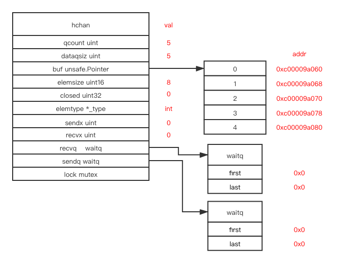
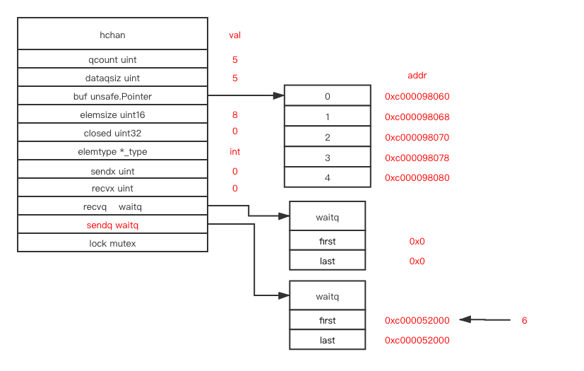
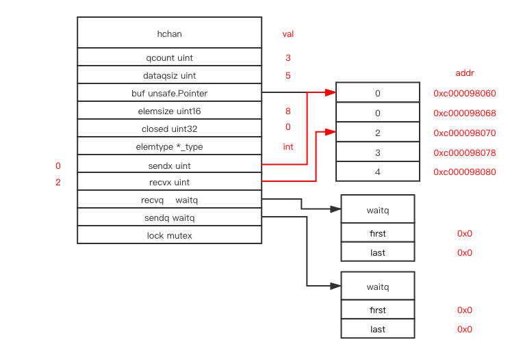
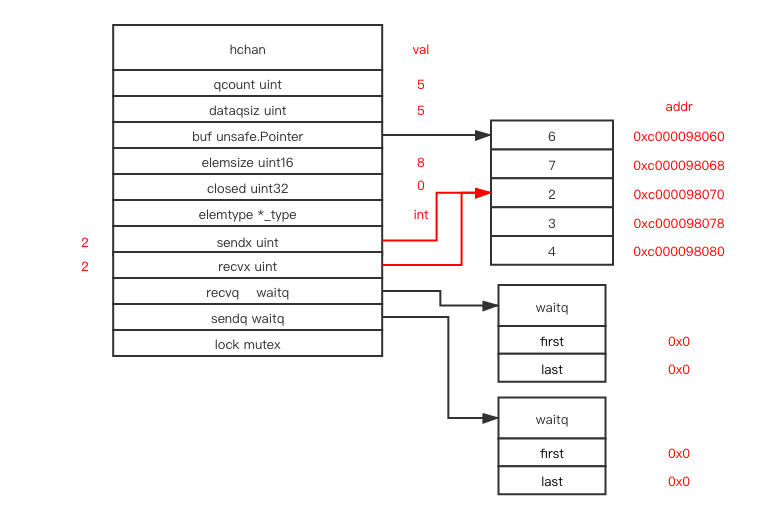

# chan

## contents

[related file](#related-file)

[memory layout](#memory-layout)

[allocation](#allocation)

[send](#send)

[recv](#recv)

[select](#select)

[example](#example)

* [sendq and recvq](#sendq-and-recvq)
* [sendx and recvx](#sendx-and-recvx)


## related file

* src/runtime/chan.go

## memory layout


`qcount` stores total data count in the queue(current size)

`dataqsiz` is the size of circular queue(max size)

`buf` points to the beginning of the circular queue memory block

`elemsize` is the size(in bytes) of element

`closed` indicate whether the channel is closed

we leave `sendx` and `recvx` for later illustration

`recvq` is a goroutine receiver queue

`sendq` is a goroutine sender queue

`lock` is used for protection of the `hchan` data structure

## allocation

the creation of channel will finally call `makechan` in `src/runtime/chan.go`

different memory allocation path will be called for different data size

```go
	switch {
    case mem == 0:
      // Queue or element size is zero.
      c = (*hchan)(mallocgc(hchanSize, nil, true))
      // Race detector uses this location for synchronization.
      c.buf = c.raceaddr()
    case elem.ptrdata == 0:
      // Elements do not contain pointers.
      // Allocate hchan and buf in one call.
      c = (*hchan)(mallocgc(hchanSize+mem, nil, true))
      c.buf = add(unsafe.Pointer(c), hchanSize)
    default:
      // Elements contain pointers.
      c = new(hchan)
      c.buf = mallocgc(mem, elem, true)
	}
```

# send

```go
// entry point for c <- x from compiled code
//go:nosplit
func chansend1(c *hchan, elem unsafe.Pointer) {
	chansend(c, elem, true, getcallerpc())
}
```

The `chansend` will acquire the `lock`, try to pop an element and send to a goroutine if there exist a goroutine in `recvq`, if `recvq` is empty, try to store the element in the circular queue, otherwise add the current goroutine to `sendq` and block the current running goroutine(a parameter `block` controls whether the current goroutine will be blocked, currently it's `true`)


## recv

```go
// entry points for <- c from compiled code
//go:nosplit
func chanrecv1(c *hchan, elem unsafe.Pointer) {
	chanrecv(c, elem, true)
}
```

The procedure of `chanrecv` is similar to the procedure of `chansend`

First acquire the `lock`, try to pop an element and receive from a goroutine if there exist a goroutine in `sendq`, if `sendq` is empty, try to receive element from the circular queue, otherwise add the current goroutine to `recvq` and block the current running goroutine(a parameter `block` controls whether the current goroutine will be blocked, currently it's `true`)


## select

select is implemented as the follow two function

```go
// compiler implements
//
//	select {
//	case v = <-c:
//		... foo
//	default:
//		... bar
//	}
//
// as
//
//	if selectnbrecv(&v, c) {
//		... foo
//	} else {
//		... bar
//	}
//
func selectnbsend(c *hchan, elem unsafe.Pointer) (selected bool) {
	return chansend(c, elem, false, getcallerpc())
}

// compiler implements
//
//	select {
//	case v, ok = <-c:
//		... foo
//	default:
//		... bar
//	}
//
// as
//
//	if c != nil && selectnbrecv2(&v, &ok, c) {
//		... foo
//	} else {
//		... bar
//	}
//
func selectnbrecv(elem unsafe.Pointer, c *hchan) (selected bool) {
	selected, _ = chanrecv(c, elem, false)
	return
}
```

select send and select receive calls the same function as [send](#send) and [recv](#recv), except that the `block` parameter is `false` instead of `true`

```go
func chanrecv(c *hchan, ep unsafe.Pointer, block bool) (selected, received bool) {
	// ...
  	if !block {
			unlock(&c.lock)
			return false, false
	}
  // ...
}

func chansend(c *hchan, ep unsafe.Pointer, block bool, callerpc uintptr) bool {
  // ...
  	if !block {
			unlock(&c.lock)
			return false
	}
  // ...
}
```

`chanrecv` and `chansend` both check the `block` parameter to see if it needs to block the current goroutine


## example

### sendq and recvq

```go
package main

var c chan int = make(chan int, 5)

func main() {
	for i := 0; i < 5; i++ {
		c <- i
	}
}

```



This is the state after running `example`, `dataqsiz` is 5 indicate there are 5 item in the queue, `buf` points to the beginning of the element's memory block, `elemsize` is 8, which is size of `int` in golang in my machine

`closed` indicate whether the channel is closed

If we send one more time

```go
c <- 6
```



The current goroutine will block and added to the wait queue in `sendq`, and the value pointer is attached to the current goroutine, stored inside the `sudog` structure

If we add one more sender

```go
package main

import "time"

var c chan int = make(chan int, 5)

func send() {
	time.Sleep(2 * time.Second)
	c <- 7
}

func main() {
	go send()
	for i := 0; i < 5; i++ {
		c <- i
	}
	c <- 6
}
```


The `recvq` has the same structure as `sendq`, while it stores all the goroutines blocking in receiving from the channel

### sendx and recvx

If we run the following new example

```go
package main

var c chan int = make(chan int, 5)

func main() {
	for i := 0; i < 5; i++ {
		c <- i
	}
	// break point 1
	<- c
	<- c
	// break point 2
	c <- 6
	c <- 7
	// break point 3
}

```

In `break point 1`, the situation is the same as the initial state in [example](#example)


In `break point 2`, the `recvx` is moved forward by 2, while `sendx` remains the same, `qcount` becomes 3



In `break point 3`， the `recvx` also moved forawrd 2, `qcount` becomes 5， the channel becomes full



