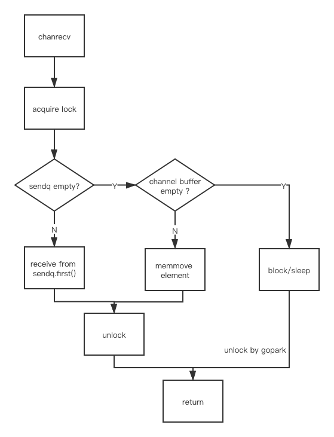

# Chan

## contents

[related file](#related-file)

[memory layout](#memory-layout)

[allocation](#allocation)

[send](#send)

[recv](#recv)

[read more](#read-more)


## related file

* src/runtime/chan.go

## memory layout


`qcount` stores total data count in the queue

`dataqsiz` is the size of circular queue

`buf` points to the beginning of the circular queue

`elemsize` is the size(in bytes) of element number currently in the channel

`closed` indicate whether the channel is closed

we leave `sendx` and `recvx` for later illustration

`recvq` is a receiver queue

`sendq` is a sender queue

`lock` is used for protection of the `hchan` data structure

## allocation

the creation of channel will finally call `makechan` in `src/runtime/chan.go`

different memory allocation path will be called for different data size

```go
	switch {
	case mem == 0:
		// Queue or element size is zero.
		c = (*hchan)(mallocgc(hchanSize, nil, true))
		// Race detector uses this location for synchronization.
		c.buf = c.raceaddr()
	case elem.ptrdata == 0:
		// Elements do not contain pointers.
		// Allocate hchan and buf in one call.
		c = (*hchan)(mallocgc(hchanSize+mem, nil, true))
		c.buf = add(unsafe.Pointer(c), hchanSize)
	default:
		// Elements contain pointers.
		c = new(hchan)
		c.buf = mallocgc(mem, elem, true)
	}
```

# send

```go
// entry point for c <- x from compiled code
//go:nosplit
func chansend1(c *hchan, elem unsafe.Pointer) {
	chansend(c, elem, true, getcallerpc())
}
```

The `chansend` will acquire the `lock`, try to pop an element and send to a goroutine if there exist a goroutine in `recvq`, if `recvq` is empty, try to store the element in the circular queue, otherwise block the current running goroutine


## recv

```go
// entry points for <- c from compiled code
//go:nosplit
func chanrecv1(c *hchan, elem unsafe.Pointer) {
	chanrecv(c, elem, true)
}
```

The procedure to `chanrecv` is similar to the procedure of `chansend`

First acquire the `lock`, try to pop an element and receive from a goroutine if there exist a goroutine in `sendq`, if `sendq` is empty, try to receive element from the circular queue, otherwise block the current running goroutine



