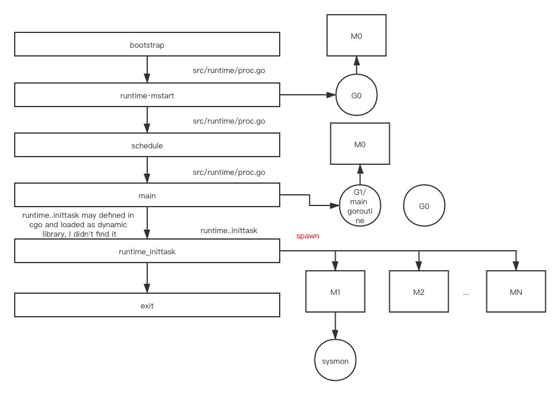
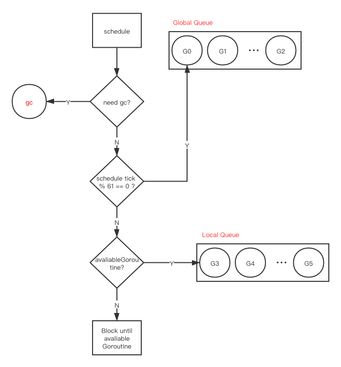

# goroutine

## contents

[related file](#related-file)

[overview](#overview)

[schedule](#schedule)

[memory layout](#memory-layout)

[read more](#read-more)

## related file

* src/runtime/runtime2.go
* src/runtime/proc.go
* src/plugin/plugin_dlopen.go

## overview

If you're coufused about **What MPG means in go scheduling and how it works**, please read [scheduling-in-go-part1](https://www.ardanlabs.com/blog/2018/08/scheduling-in-go-part1.html) ~ [scheduling-in-go-part3](https://www.ardanlabs.com/blog/2018/12/scheduling-in-go-part3.html) first in [read more](#read-more)

According to the above article and comment in Go source code

> M
>
> An OS Thread, The ‘M’ stands for machine. This Thread is still managed by the OS and the OS is still responsible for placing the Thread on a Core for execution
>
> P
>
> Logical Processor, a resource that is required to execute Go code. M must have an associated P to execute Go code, however it can be blocked or in a syscall w/o an associated P
>
> G
>
> A Goroutine is essentially a [Coroutine](https://en.wikipedia.org/wiki/Coroutine) but this is Go, so we replace the letter “C” with a “G” and we get the word Goroutine. You can think of Goroutines as application-level threads and they are similar to OS Threads in many ways. Just as OS Threads are context-switched on and off a core, Goroutines are context-switched on and off an M.


```shell
# GOSSAFUNC=main GOOS=linux GOARCH=amd64 go build -gcflags "-S" simple.go
# GOSSAFUNC=main go_dev build -gcflags "-S" num_cpu.go
# GODEBUG=schedtrace=DURATION,gctrace=1 go_dev run num_cpu.go
GODEBUG=schedtrace=DURATION go_dev run num_cpu.go
find . -name '*.go' -exec grep -nHr 'inittask' {} \;
```

Part of the bootstrap procedure use the default **M**(**M0**) to execute the run **G** which execute `runtime.mstart`, `runtime.mstart` will finally reach the `schedule` function which let **G1** runs on **M0**, **G1** will enter the `main` function defined in `runtime/proc.go`, and the `doInit(&runtime_inittask)` inside the `main` function will spawn N **M**(threads) by default, N is the number of processor number(including hyper-threading process), after that **G1** reach the end of code and call `exit(0)`



For each **M** in **M1** ... **MN**, there will be a new **G** running on it, and `runtime.mstart` also will be called for each **M**, they will finally enter the `schedule` function and let the runtime scheduler arrange everything

I didn't find `runtime_inittask` in any `go` file and `c` file, but I did fiind a function to load `inittask` from`c` in `src/plugin/plugin_dlopen.go`, I will leave it later(If you find it before I did, you are very welcome to make a pull request)

## schedule

The `schedule` function is defined in `src/runtime/proc.go`

```go
// One round of scheduler: find a runnable goroutine and execute it.
// Never returns.
func schedule() {
		// ...
  	if gp == nil && gcBlackenEnabled != 0 {
		gp = gcController.findRunnableGCWorker(_g_.m.p.ptr())
		tryWakeP = tryWakeP || gp != nil
		}
  	if gp == nil {
		// Check the global runnable queue once in a while to ensure fairness.
		// Otherwise two goroutines can completely occupy the local runqueue
		// by constantly respawning each other.
		if _g_.m.p.ptr().schedtick%61 == 0 && sched.runqsize > 0 {
			lock(&sched.lock)
			gp = globrunqget(_g_.m.p.ptr(), 1)
			unlock(&sched.lock)
		}
	}
	if gp == nil {
		gp, inheritTime = runqget(_g_.m.p.ptr())
		// We can see gp != nil here even if the M is spinning,
		// if checkTimers added a local goroutine via goready.
	}
	if gp == nil {
		gp, inheritTime = findrunnable() // blocks until work is available
	}
	// ...
  execute(gp, inheritTime)
}
```

 The schedule procedure is clear




 ## read more

[scheduling-in-go-part1](https://www.ardanlabs.com/blog/2018/08/scheduling-in-go-part1.html)

[scheduling-in-go-part2](https://www.ardanlabs.com/blog/2018/08/scheduling-in-go-part2.html)

[scheduling-in-go-part3](https://www.ardanlabs.com/blog/2018/12/scheduling-in-go-part3.html)

[how-a-go-program-compiles-down-to-machine-code](https://getstream.io/blog/how-a-go-program-compiles-down-to-machine-code/)

[https://sitano.github.io/2016/04/28/golang-private/](How to call private functions (bind to hidden symbols) in GoLang)

